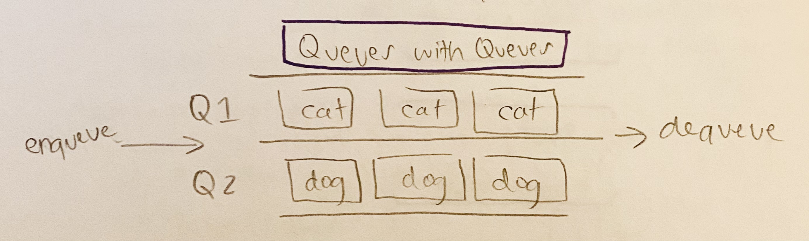

# Queue with Stacks

- [Link to PR](https://github.com/LydiaMT/data-structures-and-algorithms/pull/30)
- [Link to code](https://github.com/LydiaMT/data-structures-and-algorithms/blob/main/javascript/code-challenges/fifoAnimalShelter/fifo-animal-shelter.js)
- [Link to tests](https://github.com/LydiaMT/data-structures-and-algorithms/blob/main/javascript/code-challenges/fifoAnimalShelter/__test__/fifo-animal-shelter.test.js)

## Challenge

- Create a class called AnimalShelter which holds only dogs and cats. The shelter operates using a first-in, first-out approach.
- Implement the following methods:
  - `enqueue(animal)`: adds `animal` to the shelter. `animal` can be either a dog or a cat object.
  - `dequeue(pref)`: returns either a dog or a cat. If `pref` is not `"dog"` or `"cat"` then return null.

## Example 

## Test

### `npm run test fifo-animal-shelter.test.js`

## Approach & Efficiency

## API

- [Colt Steele - Master Class](https://www.udemy.com/share/101XY2BUQedlZVRXQ=/)
- Shout out to Peter Staker helping me realize that I could import the Queue class I made earlier this week. 