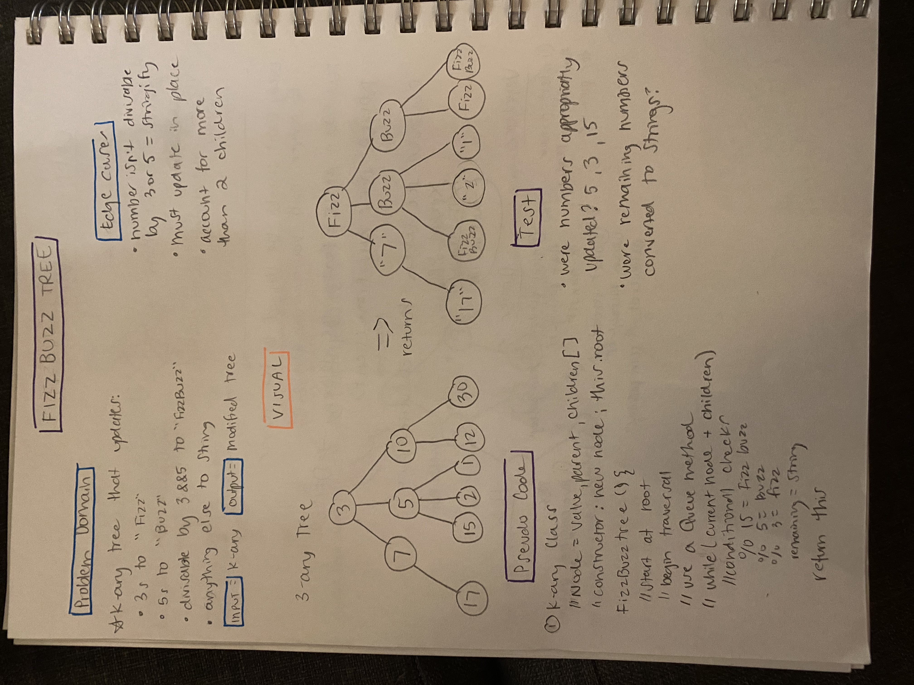

# Fizz Buzz Tree

- [Link to PR](https://github.com/LydiaMT/data-structures-and-algorithms/pull/35)
- [Link to code](https://github.com/LydiaMT/data-structures-and-algorithms/blob/main/javascript/code-challenges/fizzBuzzTree/fizz-buzz-tree.js)
- [Link to tests](https://github.com/LydiaMT/data-structures-and-algorithms/blob/main/javascript/code-challenges/fizzBuzzTree/__test__/fizz-buzz-tree.test.js)

## Challenge

- Write a function called `FizzBuzzTree which` takes a k-ary tree as an argument.
- Without utilizing any of the built-in methods available to your language, determine whether or not the value of each node is divisible by 3, 5 or both. Create a new tree with the same structure as the original, but the values modified as follows:
 - If the value is divisible by 3, replace the value with “Fizz”
 - If the value is divisible by 5, replace the value with “Buzz”
 - If the value is divisible by 3 and 5, replace the value with “FizzBuzz”
 - If the value is not divisible by 3 or 5, simply turn the number into a String.
- Return a **new** tree.

## Approach & Efficiency

- Create a k-ary node: will need to include a children element that is an array of all the children nodes
- Create a k-ary instance
- Create method fizzBuzzTree
  - This method needs to traverse the k-ary tree
  - As it traverses, it should commit the FizzBuzz checks
  - It should update the values appropriatly to Fizz, Buzz, FizzBuzz, or a string

## Testing & Edge cases

- It should replace values divisible by 3 with "Fizz"
- It should replace values divisible by 5 with "Buzz"
- It should replace values divisible by 3 and 5 with "FizzBuzz"
- It should turn the value into a string if the value is not divisiable by 3 and/or 5

### `npm run test fizz-buzz-tree.test.js`

## API

- [Colt Steele - Master Class](https://www.udemy.com/share/101XY2BUQedlZVRXQ=/)
- [Khushboo Taneja - Medium](https://medium.com/@khushboo.taneja_61450/implementing-binary-search-tree-and-n-ary-tree-in-javascript-ba3e2081d345)