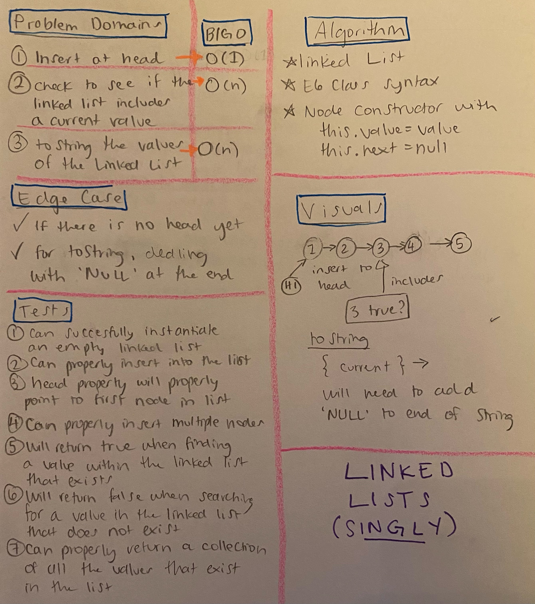

# Singly Linked List

- [Link to PR](https://github.com/LydiaMT/data-structures-and-algorithms/pull/24)
- [Link to code](https://github.com/LydiaMT/data-structures-and-algorithms/blob/main/javascript/code-challenges/linkedList/linked-list.js)
- [Link to tests](https://github.com/LydiaMT/data-structures-and-algorithms/blob/main/javascript/code-challenges/linkedList/__test__/linked-list.test.js)

## Test
`npm run test linked-list.test.js`

## Challenge
- Create a Node class that has properties for the value stored in the Node, and a pointer to the next Node.
- Within your LinkedList class, include a head property. Upon instantiation, an empty Linked List should be created.
    - Define a method called `insert` which takes any value as an argument and adds a new node with that value to the `head` of the list with an O(1) Time performance.
    - Define a method called `includes` which takes any value as an argument and returns a boolean result depending on whether that value exists as a Node’s value somewhere within the list.
    - Define a method called `toString` which takes in no arguments and returns a string representing all the values in the Linked List, formatted as:
      - `"{ a } -> { b } -> { c } -> NULL"`
## Approach & Efficiency

## API

- [Arnav Aggarwal - JS Data Structures: Linked List](https://codeburst.io/js-data-structures-linked-list-3ed4d63e6571)
- [Colt Steele - Master Class](https://www.udemy.com/share/101XY2BUQedlZVRXQ=/)