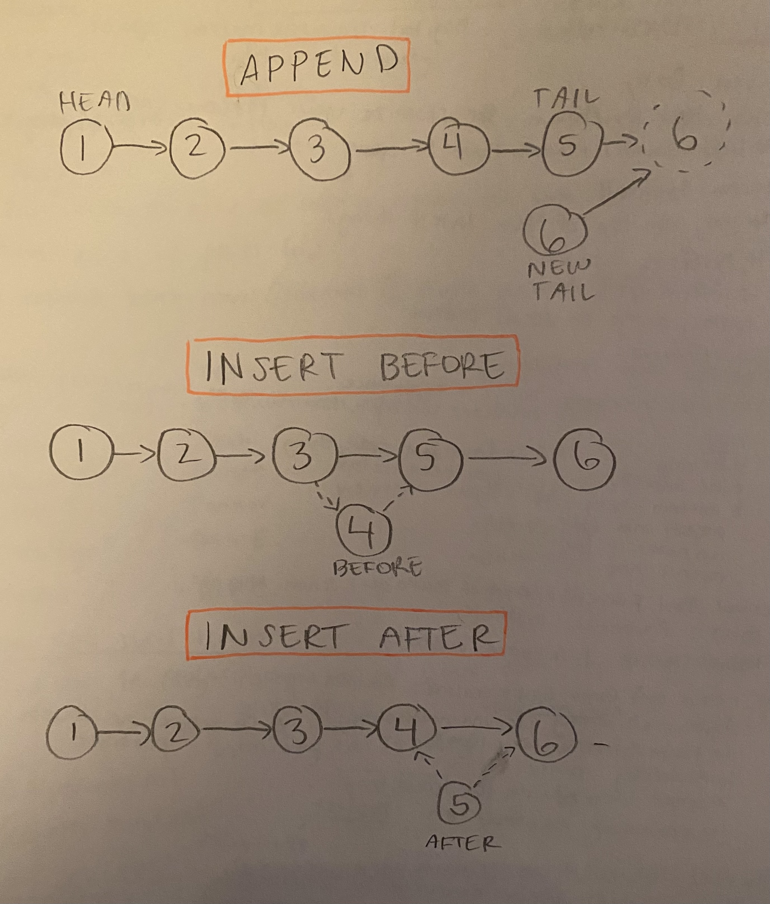

# Singly Linked List

- [Link to PR](https://github.com/LydiaMT/data-structures-and-algorithms/pull/25)
- [Link to code](https://github.com/LydiaMT/data-structures-and-algorithms/blob/main/javascript/code-challenges/linkedList/linked-list.js)
- [Link to tests](https://github.com/LydiaMT/data-structures-and-algorithms/blob/main/javascript/code-challenges/linkedList/__test__/linked-list.test.js)

## Test
`npm run test linked-list.test.js`

1. Can successfully add a node to the end of the linked list
1. Can successfully add multiple nodes to the end of a linked list
1. Can successfully insert a node before a node located i the middle of a linked list
1. Can successfully insert a node before the first node of a linked list
1. Can successfully insert after a node in the middle of the linked list
1. Can successfully insert a node after the last node of the linked list

## Challenge

Write the following methods for the Linked List class:

- `.append(value)` which adds a new node with the given `value` to the end of the list
- `.insertBefore(value, newVal)` which add a new node with the given `newValue` immediately before the first `value` node
- `.insertAfter(value, newVal)` which add a new node with the given `newValue` immediately after the first `value` node

## Example 

### `.append(value)`

INPUT | ARGS | OUTPUT
-----|-----|-----
head -> [1] -> [3] -> [2] -> X | 	5	 |head -> [1] -> [3] -> [2] -> [5] -> X
head -> X	| 1	| head -> [1] -> X

### `.insertBefore(value, newVal)`

INPUT | ARGS | OUTPUT
-----|-----|-----
head -> [1] -> [3] -> [2] -> X |	3, 5|	head -> [1] -> [5] -> [3] -> [2] -> X
head -> [1] -> [3] -> [2] -> X	|1, 5|	head -> [5] -> [1] -> [3] -> [2] -> X
head -> [1] -> [2] -> [2] -> X|	2, 5|	head -> [1] -> [5] -> [2] -> [2] -> X
head -> [1] -> [3] -> [2] -> X|	4, 5|	Exception

### `.insertAfter(value, newVal)`

INPUT | ARGS | OUTPUT
-----|-----|-----
head -> [1] -> [3] -> [2] -> X|	3, 5|	head -> [1] -> [3] -> [5] -> [2] -> X
head -> [1] -> [3] -> [2] -> X|	2, 5	|head -> [1] -> [3] -> [2] -> [5] -> X
head -> [1] -> [2] -> [2] -> X|	2, 5|	head -> [1] -> [2] -> [5] -> [2] -> X
head -> [1] -> [3] -> [2] -> X|	4, 5|	Exception

## Approach & Efficiency

## API

- [Visual Algo - Linked List Insert](https://visualgo.net/en/list)
- [Colt Steele - Master Class](https://www.udemy.com/share/101XY2BUQedlZVRXQ=/)