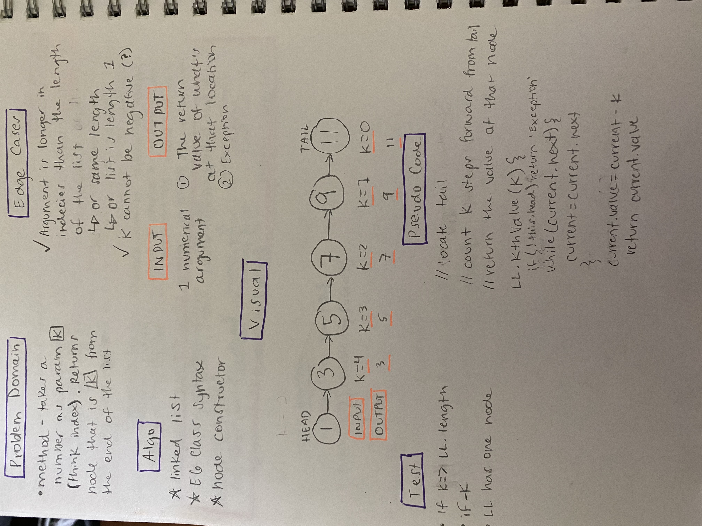

# Singly Linked List

- [Link to PR](https://github.com/LydiaMT/data-structures-and-algorithms/pull/26)
- [Link to code](https://github.com/LydiaMT/data-structures-and-algorithms/blob/main/javascript/code-challenges/linkedList/linked-list.js)
- [Link to tests](https://github.com/LydiaMT/data-structures-and-algorithms/blob/main/javascript/code-challenges/linkedList/__test__/linked-list.test.js)

## Test
`npm run test linked-list.test.js`

1. Where k is greater than the length of the linked list
1. Where k and the length of the list are the same
1. Where k is not a positive integer
1. Where the linked list is of a size 1
1. “Happy Path” where k is not at the end, but somewhere in the middle of the linked list

## Challenge

Write a method for the Linked List class which takes a number, `k`, as a parameter. Return the node’s value that is `k` from the end of the linked list. You have access to the Node class and all the properties on the Linked List class as well as the methods created in previous challenges.

## Example 

### `newLinkedList.kthFromEnd(k)`

INPUT `ll` | ARGS `k`| OUTPUT
-----|-----|-----
head -> [1] -> [3] -> [8] -> [2] -> X	| 0	| 2
head -> [1] -> [3] -> [8] -> [2] -> X	| 2	| 3
head -> [1] -> [3] -> [8] -> [2] -> X	| 6	| Exception

## Approach & Efficiency

## API

- [Sumit Jain - Find the n’th Node from the end of a given Linked List](https://algorithms.tutorialhorizon.com/to-find-the-kth-to-last-element-of-a-singly-linked-list/)
- [Colt Steele - Master Class](https://www.udemy.com/share/101XY2BUQedlZVRXQ=/)