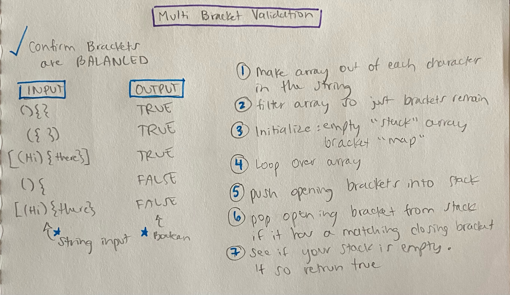

# Multi Bracket Validation

- [Link to PR](https://github.com/LydiaMT/data-structures-and-algorithms/pull/31)
- [Link to code](https://github.com/LydiaMT/data-structures-and-algorithms/blob/main/javascript/code-challenges/multiBracketValidation/multi-bracket-validation.js)
- [Link to tests](https://github.com/LydiaMT/data-structures-and-algorithms/blob/main/javascript/code-challenges/multiBracketValidation/__test__/multi-bracket-validation.test.js)

## Challenge

On your main file, create a function called `multiBracketValidation(input)`. Your function should take a string as its only argument, and should return a boolean representing whether or not the brackets in the string are balanced. There are 3 types of brackets:
- Round Brackets : `()`
- Square Brackets : `[]`
- Curly Brackets : `{}`

## Example

INPUT | OUTPUT
-----|-----
`{}`	| TRUE
`{}(){}`	| TRUE
`()[[Extra Characters]]`	| TRUE
`(){}[[]]`	| TRUE
`{}{Code}[Fellows](())`	| TRUE
`[({}]`	| FALSE
`(](`	| FALSE
`{(})`	| FALSE

Consider these small examples and why they fail.

INPUT | OUTPUT | WHY
-----|-----|-----
`{`	| FALSE	| error unmatched opening `{` remaining.
`)`	| FALSE	| error closing `)` arrived without corresponding opening.
`[}`	| FALSE	| error closing `}`. Doesn’t match opening `(`.

## Test

### `npm run test multi-bracket-validation.test.js`

## Approach & Efficiency

## API

- [Parenthesis Matching Problem in JavaScript @ The Hacking School Hyd - Rohan Paul](https://paulrohan.medium.com/parenthesis-matching-problem-in-javascript-the-hacking-school-hyd-7d7708278911)
- [MDN](https://developer.mozilla.org/en-US/docs/Web/JavaScript/Reference/Global_Objects/Array/filter)
