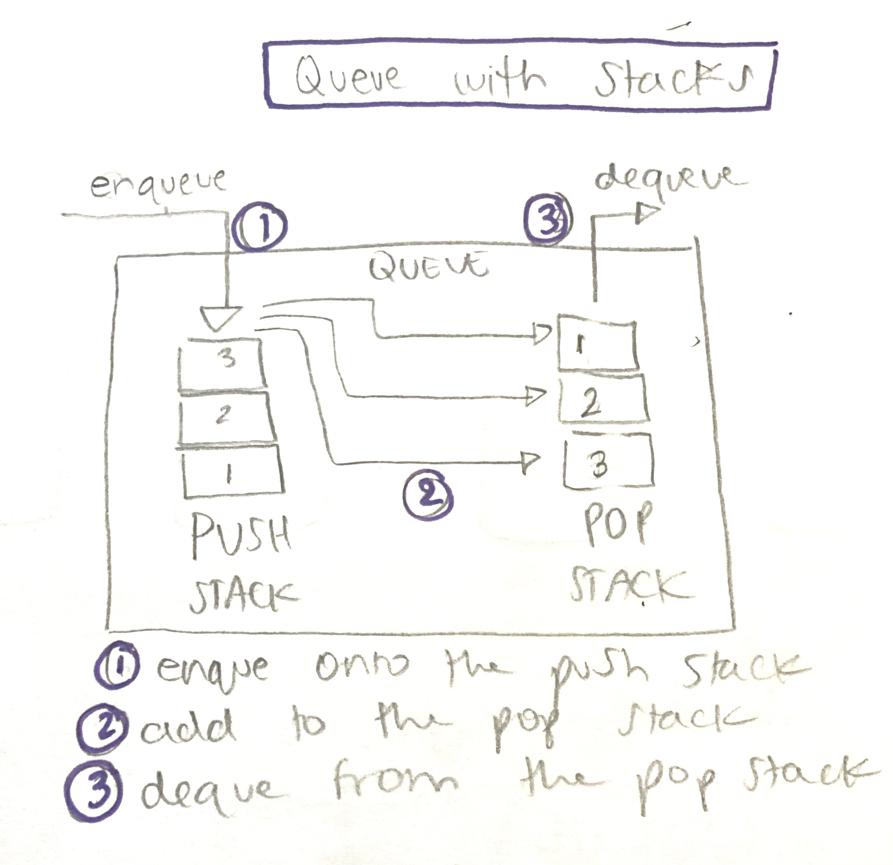

# Queue with Stacks

- [Link to PR](https://github.com/LydiaMT/data-structures-and-algorithms/pull/29)
- [Link to code](https://github.com/LydiaMT/data-structures-and-algorithms/blob/main/javascript/code-challenges/queueWithStacks/queue-with-stacks.js)
- [Link to tests](https://github.com/LydiaMT/data-structures-and-algorithms/blob/main/javascript/code-challenges/queueWithStacks/__test__/queue-with-stacks.test.js)

## Challenge

Create a brand new `PseudoQueue` class. Do not use an existing Queue. Instead, this PseudoQueue class will implement our standard queue interface (the two methods listed below), but will internally only utilize 2 `Stack` objects. Ensure that you create your class with the following methods:

- `enqueue(value)` which inserts `value` into the PseudoQueue, using a first-in, first-out approach.
- `dequeue()` which extracts a value from the PseudoQueue, using a first-in, first-out approach.

The `Stack` instances have only `push`, `pop`, and `peek` methods. You should use your own Stack implementation. Instantiate these Stack objects in your PseudoQueue constructor.

## Example 

`enqueue(value)`
INPUT |	ARGS | OUTPUT
---- | ---- | -----
[10]->[15]->[20] | 5	| [5]->[10]->[15]->[20]
(NOTHING) | 5	| [5]

`dequeue()`
INPUT |	ARGS | OUTPUT
-----|-------|-------
[5]->[10]->[15]->[20] |	20	|[5]->[10]->[15]
[5]->[10]->[15]	| 15	| [5]->[10]

## Test

### `npm run test queue-with-stacks.test.js`

## Approach & Efficiency

## API

- [Saurabh Dashora - Implementing Queue using Stacks in Javascript](http://progressivecoder.com/implementing-queue-using-stacks-in-javascript/)
- [Colt Steele - Master Class](https://www.udemy.com/share/101XY2BUQedlZVRXQ=/)