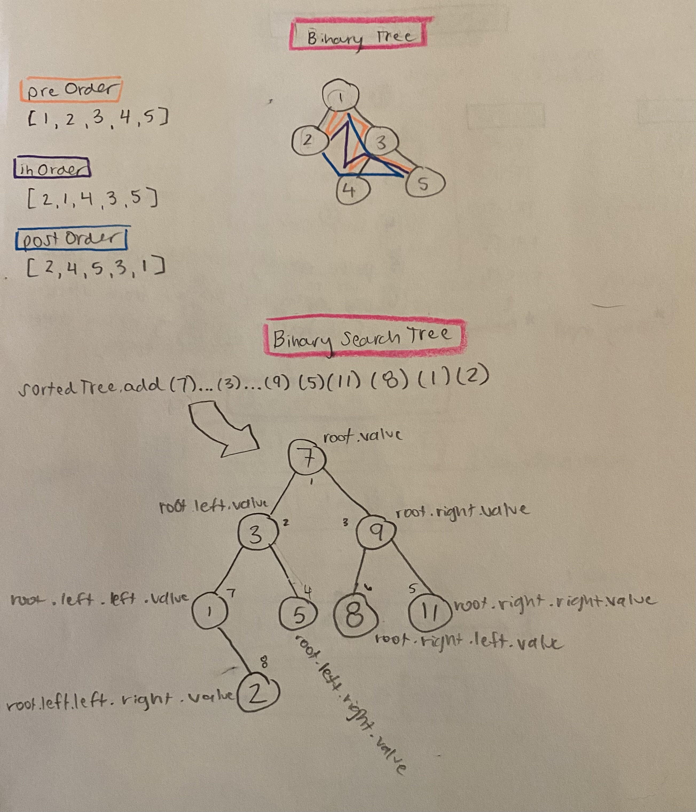

# Binary Search Tree

- [Link to PR](https://github.com/LydiaMT/data-structures-and-algorithms/pull/32)
- [Link to code](https://github.com/LydiaMT/data-structures-and-algorithms/blob/main/javascript/code-challenges/tree/lib)
- [Link to tests](https://github.com/LydiaMT/data-structures-and-algorithms/blob/main/javascript/code-challenges/tree/__test__/tree.test.js)

## Challenge

- Create a Node class that has properties for the value stored in the node, the left child node, and the right child node.
- Create a BinaryTree class
  - Define a method for each of the depth first traversals called `preOrder`, `inOrder`, and `postOrder` which returns an array of the values, ordered appropriately.
- Any exceptions or errors that come from your code should be semantic, capturable errors. For example, rather than a default error thrown by your language, your code should raise/throw a custom, semantic error that describes what went wrong in calling the methods you wrote for this lab.

- Create a BinarySearchTree class
  - Define a method named `add` that accepts a value, and adds a new node with that value in the correct location in the binary search tree.
  - Define a method named `contains` that accepts a value, and returns a boolean indicating whether or not the value is in the tree at least once.

## Test

### `npm run test tree.test.js`

Binary Tree Tests
1. a new node can be created and added to the tree
1. a node has a value left & right property
1. preOrder will log or traverse in the right way
1. inOrder will log or traverse in the right way
1. postOrder will log or traverse in the right way

Binary Search Tree Tests
1. a new node can be created and added to the tree, keeping the tree appropriately sorted
1. contains will return true if the tree contains the value
1. contains will return false if the tree contains the value

## Approach & Efficiency

## API

- [Colt Steele - Master Class](https://www.udemy.com/share/101XY2BUQedlZVRXQ=/)
