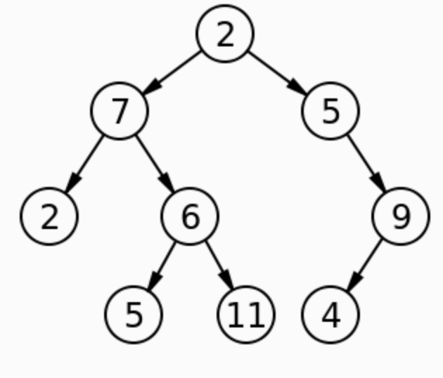

# Find the Maximum Value in a Binary Tree

- [Link to PR](https://github.com/LydiaMT/data-structures-and-algorithms/pull/33)
- [Link to code](https://github.com/LydiaMT/data-structures-and-algorithms/blob/main/javascript/code-challenges/tree/lib)
- [Link to tests](https://github.com/LydiaMT/data-structures-and-algorithms/blob/main/javascript/code-challenges/tree/__test__/tree.test.js)

## Challenge

Extend your `BinaryTree` class according to the feature tasks below

Write an instance method called `find-maximum-value`. Without utilizing any of the built-in methods available to your language, return the maximum value stored in the tree. You can assume that the values stored in the Binary Tree will be numeric.

## Example

If you were to run `find-maximum-value` on the below method, it should return `11`

## Approach & Efficiency

- Utilize one of the DFS traversal methods already created in the class
- Establish a variable called 'currentMax' that takes the first item in the array
- Loop over the array; initialize i at 1
- Use a Boolean to compare array[i] to the currentMax
- if array[i] is greater than currentMax, reassign currentMax to array[i]
- return currentMax

## Testing & Edge cases

- It should return the highest value in a binary tree
- It should work on negative numbers
- It should work on a non-sorted tree

### `npm run test tree.test.js`

## API

- [Colt Steele - Master Class](https://www.udemy.com/share/101XY2BUQedlZVRXQ=/)
