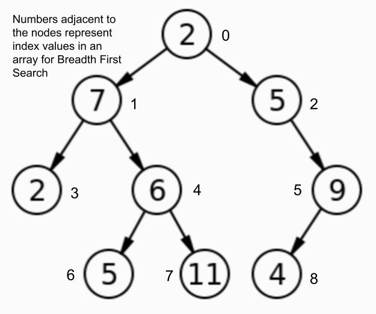

# Breadth First Search

- [Link to PR](https://github.com/LydiaMT/data-structures-and-algorithms/pull/34)
- [Link to code](https://github.com/LydiaMT/data-structures-and-algorithms/blob/main/javascript/code-challenges/tree/lib)
- [Link to tests](https://github.com/LydiaMT/data-structures-and-algorithms/blob/main/javascript/code-challenges/tree/__test__/tree.test.js)

## Challenge

Extend your `BinaryTree` class according to the feature tasks below

Write a breadth first traversal method which takes a Binary Tree as its unique input. Without utilizing any of the built-in methods available to your language, traverse the input tree using a Breadth-first approach, and return a list of the values in the tree in the order they were encountered.

## Example

If you were to run `breadthFirstSearch` on the below method, it should return `[2,7,5,2,6,9,5,11,4]`

## Approach & Efficiency

- Start at the root
- Have an array for the values and a staging array that has all the nodes
- Interative Method: use a while loop that loops while there are still nodes in the queue array
- Take the first node from the queue array, and push it's value into the data array
- check all lefts & rights before going further down

## Testing & Edge cases

- It should return an array in breadth search first order

### `npm run test tree.test.js`

## API

- [Colt Steele - Master Class](https://www.udemy.com/share/101XY2BUQedlZVRXQ=/)